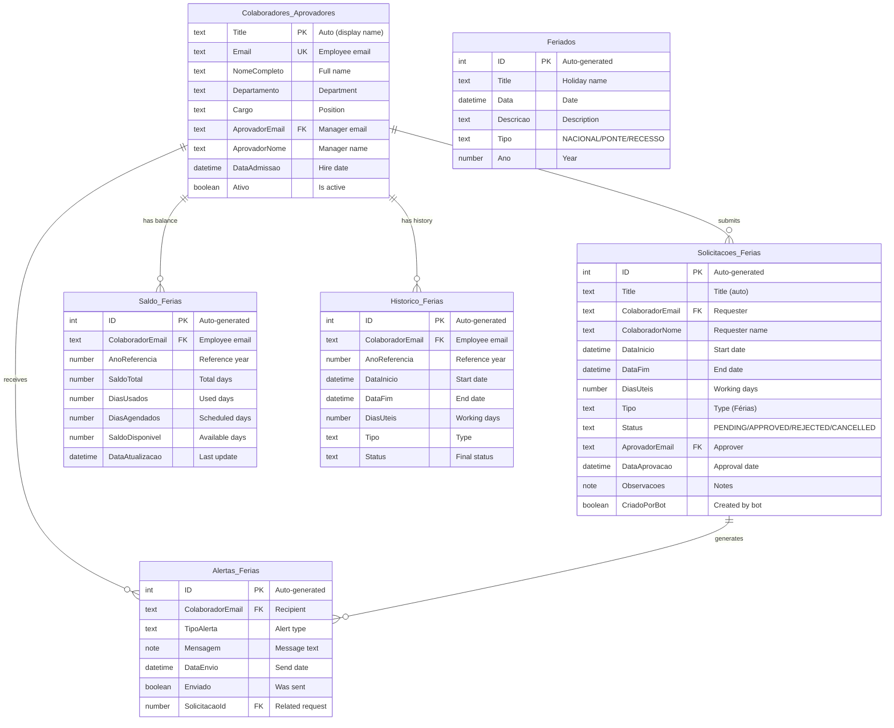

# Data Model

## Entity Relationship Diagram

## Current Data Volumes

| List | Records | Sources |
|------|---------|---------|
| Colaboradores_Aprovadores | 13 | Excel import (`Users_Approvers.xlsx`) |
| Feriados | 19 | Script-generated (2026 holidays) |
| Solicitacoes_Ferias | 0 | Runtime (agent creates) |
| Historico_Ferias | 0 | Runtime (flow populates) |
| Saldo_Ferias | 0 | Runtime (flow manages) |
| Alertas_Ferias | 0 | Runtime (scheduled flow) |

## Key Relationships

| From | To | Type | Join Key |
|------|----|------|----------|
| Solicitacoes_Ferias | Colaboradores_Aprovadores | N:1 | `ColaboradorEmail` = `Email` |
| Solicitacoes_Ferias | Colaboradores_Aprovadores | N:1 | `AprovadorEmail` = `Email` |
| Saldo_Ferias | Colaboradores_Aprovadores | N:1 | `ColaboradorEmail` = `Email` |
| Historico_Ferias | Colaboradores_Aprovadores | N:1 | `ColaboradorEmail` = `Email` |
| Alertas_Ferias | Colaboradores_Aprovadores | N:1 | `ColaboradorEmail` = `Email` |
| Alertas_Ferias | Solicitacoes_Ferias | N:1 | `SolicitacaoId` = `ID` |

## Notes

- **No SharePoint lookups used** — all relationships are text-based (email keys) for simplicity
- **No cascading deletes** — all lists are independent
- **Saldo_Ferias** requires manual initial population or auto-creation on first balance query
- **Status enum values**: `Pendente`, `Aprovado`, `Rejeitado`, `Cancelado` (Portuguese)
